# Trash Tracker: Iterative Development of a Mobile-Optimized Waste Classifier

## 1. Introduction

Recycling is one of the best ways to help the environment, but it is actually a lot harder than most people think. Many people want to recycle their trash correctly, but they often get confused by all the different rules for materials like glass, plastic, and paper. This leads to a lot of mistakes where people throw the wrong things in the recycling bin, which can actually ruin the whole batch of recycling. Right now, there are not many easy tools that help a normal person know exactly what they are holding and where it should go while they are standing in front of a trash can.

The goal of this project is to build a mobile app that solves this problem using artificial intelligence. I am developing a system that can look at an object through a phone camera and instantly tell the user what category it belongs to. The model is trained to recognize six main types of waste: biodegradable, cardboard, glass, metal, paper, and plastic. By putting this technology on a smartphone, I want to make it easy for anyone to get a fast and accurate answer about their trash.

One of the most important parts of this project is making sure the AI works directly on the phone. I do not want the app to send data to the cloud or need a fast internet connection to work. This means the model runs locally on the device making the app much faster and keeps the user's data private. The main challenge is to keep the model small enough for a phone but smart enough to get the classification right every time.

## 2. System Architecture
The project is split into two main parts: the machine learning model and the mobile application. For the brain of the app, I am using a type of artificial intelligence called YOLO, which stands for You Only Look Once. I chose the Nano version of this model because it is designed to be very lightweight. This is important because a normal phone does not have the same power as a big computer, so the model needs to be small to run smoothly without lagging. To get the model ready, I used a high-performance computer with an NVIDIA RTX 5080 GPU to run the training process. This allowed me to test different settings quickly. Once the training is finished and the model is accurate enough, I will convert it into TFLite format. This format is specifically made for mobile devices and helps the model run efficiently on a phone's processor.

The second part of the project is the mobile app itself, which I am building using Flutter. Flutter is a framework that lets the app run on both Android and iOS. The app will use the phone's camera to see the trash and then use the TFLite model to figure out what it is. Everything happens locally on the phone, so the user just has to point their camera at a piece of trash to see the classification pop up on the screen in real time.

## 3 Model Training
### 3.1 Phase 1: Baseline Training and Results
The first step of the project was to run an initial training session to see how well a small model could handle the garbage dataset. I used a dataset of about 10,000 images that were divided into seven categories. For the hardware, I used an NVIDIA RTX 5080 GPU, which made the training much faster. I ran the process for 100 epochs, which took about four hours to complete. This gave me a baseline model that I could use to measure progress in the future.

After the training, the model gave me several metrics to show how it performed. One of them is called mAP50, which stands for mean Average Precision. The model got a score of 0.60 (or 60%). This means that in this first phase, the model is correct about 60% of the time when it identifies an object. For precision and recall for each category, Glass had a high precision of 88%, meaning when the model says something is glass, it is usually right. However, Paper had a very low score of only 15%. This happened because the dataset was not balanced. There were over 13,000 instances of biodegradable waste but only 33 instances of paper. Because of this, the model "biased" its guesses toward the bigger categories since it saw them so much more often during training.

    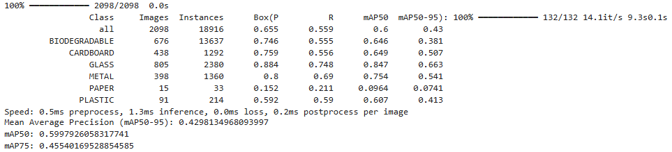
    
<strong>Fig. 1. </strong>Breakdown of precision, recall, and mAP scores across the seven garbage categories for phase 1.

To see exactly how the model was thinking, I ran it on some test images. The results were saved in a folder called predict. In this folder, the model takes the original images and draws bounding boxes over what it finds. Each box has a label and a "confidence score" showing how sure the model is. In one test, the model looked at a clear glass bottle but labeled it as PLASTIC 0.80. Because clear glass and clear plastic look very similar, the model got confused. This shows it needs more varied examples of glass in the next phase.

    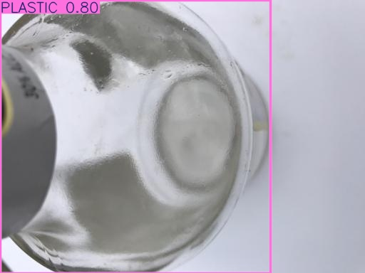
    
<strong>Fig. 2. </strong>An example of model confusion where a clear glass object was incorrectly identified as plastic with an 80% confidence score.

On images like the tomatoes and the cardboard box, the model drew way too many boxes. It found the object correctly, but it created extra boxes for different parts of the same item. This makes the screen look messy and confusing for a user.

    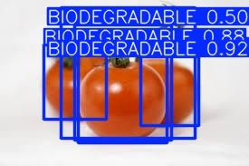
    
<strong>Fig. 3. </strong>The model generates multiple overlapping bounding boxes for individual items, such as these tomatoes, creating a cluttered output.

    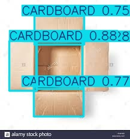
    
<strong>Fig. 4. </strong>Duplicate "Cardboard" detections on a single box.

In another case, a cardboard bar box was labeled as PAPER 0.86. This is likely because cardboard and paper have similar textures, and since the model has very few examples of paper, it is struggling to tell the two apart correctly.

    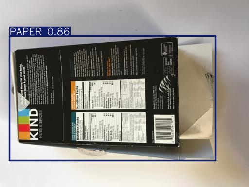
    
<strong>Fig. 5. </strong>A cardboard box incorrectly labeled as "Paper" with 86% confidence, likely due to visual similarities and a small paper dataset.

Even with the accuracy issues in some categories, the model proved that it is fast enough for a phone. On my computer, it only took about 1.3 milliseconds to process a single image. This is a very good sign because it means that even on a slower phone processor, the app should still be able to show results in real time without any lag.

### 3.2 Phase 2: Data Augmentation and Model Optimization
After analyzing the failures in Phase 1, specifically the severe bias against the "Paper" category and the cluttered multi-box detections, Phase 2 had focus on data engineering. The goal was not just to train longer, but to provide the model with a more balanced and diverse set of images. To solve the data scarcity for paper and the lack of variety in other categories, a 3x Augmentation strategy was applied via Roboflow. This expanded the dataset from 10,000 images to over 25,000 images. By applying random rotations, flips, and brightness adjustments, the model was forced to learn the "features" of the trash rather than just memorizing specific photos. Additionally, the dataset was rebalanced. In Phase 1, the model was overwhelmed by over 13,000 instances of "Biodegradable" items. In Phase 2, the training split was adjusted to ensure the model saw "Paper" and "Plastic" more frequently during each epoch. Training was again performed on the NVIDIA RTX 5080. Despite the dataset size increasing by 150%, the 5080's high VRAM allowed for an optimized training run of 100 epochs, completing in approximately 9.5 hours. The results of the training showed that while the overall accuracy (mAP50) remained stable at 0.60, the model became significantly more robust.

    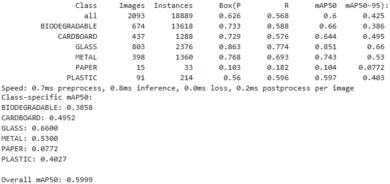
    
<strong>Fig. 6. </strong>Breakdown of precision, recall, and mAP scores across the seven garbage categories for phase 2.

While the global mAP50 remained stable at 0.60, the internal diagnostics show a much more details about the model.

    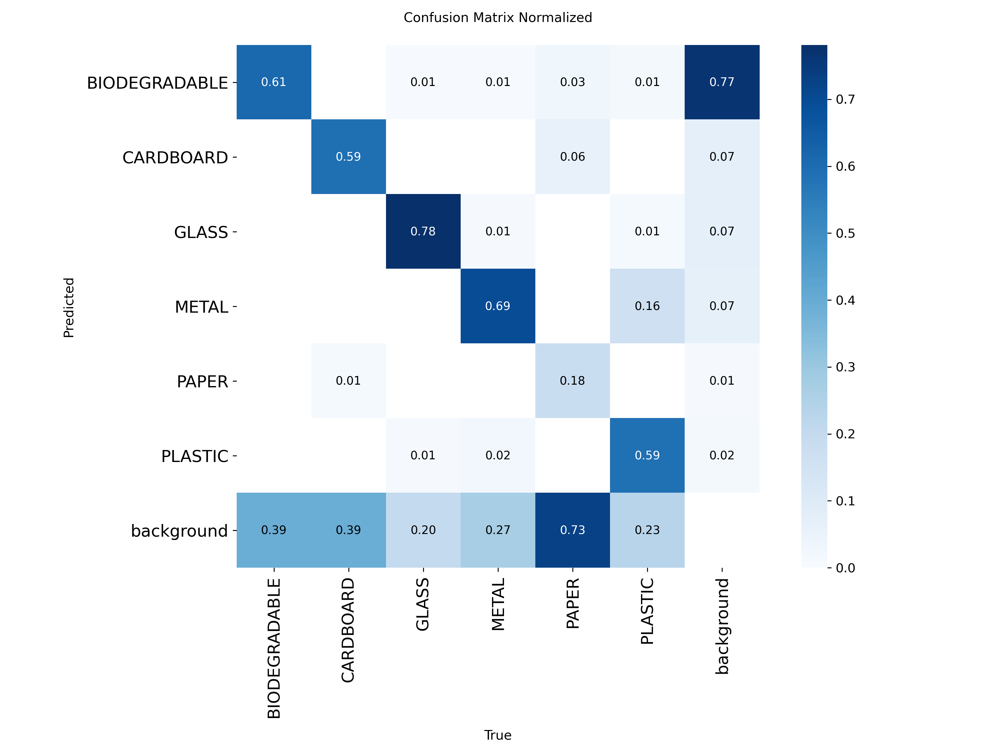
    
<strong>Fig. 7. </strong>Normalized Confusion Matrix for Phase 2, highlighting the 73% background-miss rate for Paper.

The Normalized Confusion Matrix (Fig. 7) identifies the core bottleneck. The model has achieved solid reliability in Glass (78%) and Biodegradable (61%). However, 73% of Paper instances are being misclassified as "Background." This indicates that the model is failing to propose a region of interest for paper altogether, likely due to a lack of unique feature variety in the small Paper sample size (33 instances). Additionally, there is a notable 16% confusion rate where Plastic is incorrectly identified as Metal, suggesting a need for more distinct specular-highlight examples in Phase 3.

    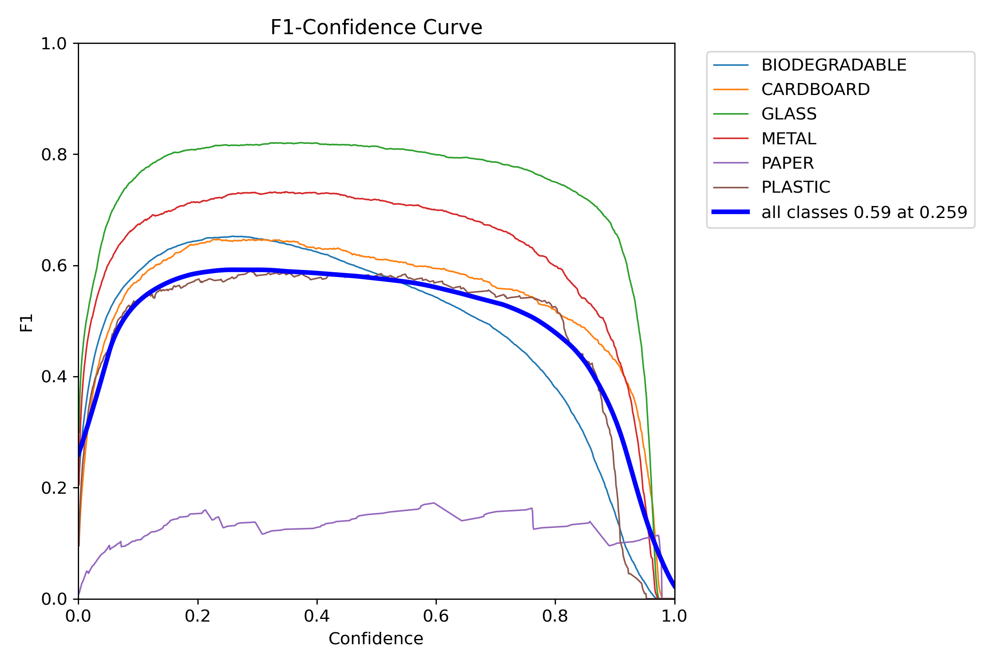
    
<strong>Fig. 8. </strong>F1-Confidence Curve showing the optimal operating threshold of 0.259.

The BoxF1-Curve (Fig. 8) reveals that the optimal balance between Precision and Recall occurs at a 0.259 confidence threshold. This data is critical for the upcoming mobile application development, as it provides the specific threshold needed to filter out "ghost" detections while maintaining a high capture rate for valid trash items.

The visual outputs from the Phase 2 validation runs demonstrate a significant "cleanup" of the detection logic compared to Phase 1.

    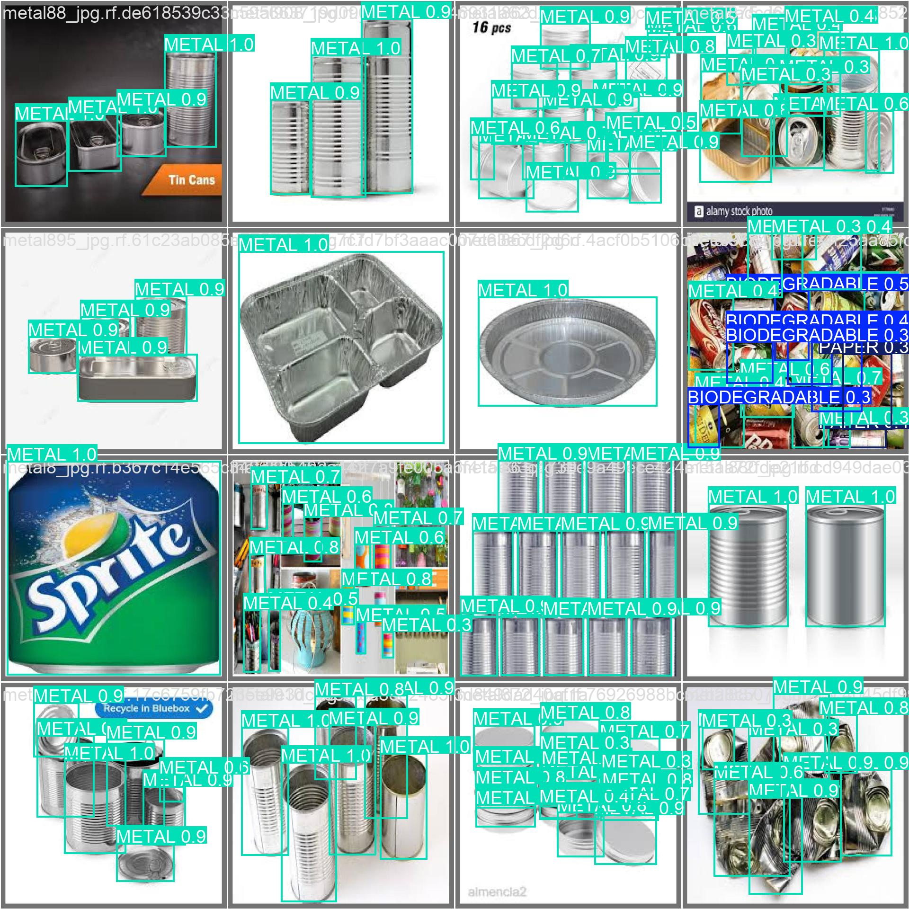
    
<strong>Fig. 9. </strong>Successful multi-object isolation of metal cans using YOLO26 NMS-Free detection.

As shown in Fig. 9, the model is now better at isolating individual items within dense clusters. Even with overlapping aluminum cans, the YOLO26 architecture produces distinct, single bounding boxes. This is a direct improvement over Phase 1, proving that the NMS-Free training effectively suppressed duplicate detections. Although, some duplication still seem to be present.

    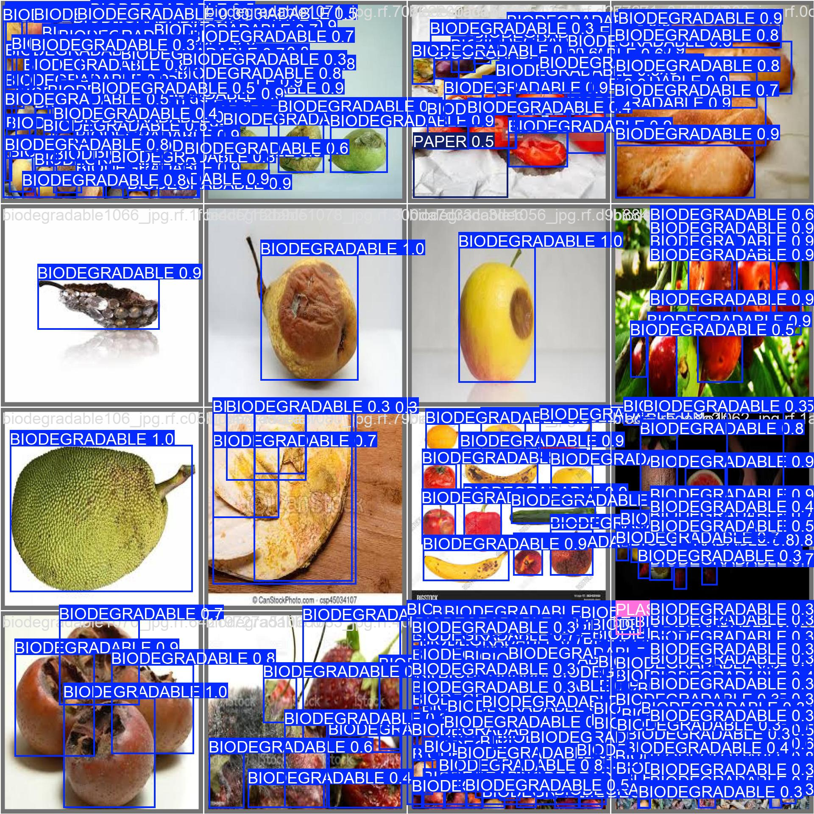
    
<strong>Fig. 10. </strong>Extreme over-detection in the Biodegradable class, where individual items are fragmented into dozens of overlapping predictions.

While Phase 2 successfully increased overall robustness, specific images in the Biodegradable category (see Fig. 10) revealed a significant issue with spatial over-detection. In scenarios featuring large piles of fruit or organic matter, the model attempts to generate a bounding box for every recognizable edge or texture change, resulting in a "visual explosion" of overlapping detections. This creates a significant dilemma: while the system must maintain "Individual Logic" to distinguish and count two side-by-side apples as distinct objects, it must also adopt a "Collective Logic" when those items form a massive, undifferentiated pile. In the latter case, a single "Biodegradable" bounding box is preferred to maintain clarity and prevent the screen from becoming obscured by redundant data.

To resolve this granularity conflict in Phase 3 without sacrificing the system's ability to count individual items, a two-pronged strategic approach will be implemented. First, a Labeling Refinement protocol will be introduced in the next data iteration to teach the model to recognize "Piles" as their own entity; large, amorphous clusters of waste will be annotated with a single encompassing bounding box, while distinct, separated items will remain individually labeled. Second, the system will utilize IoU (Intersection over Union) Threshold Tuning within the application code. By implementing a more aggressive IoU threshold (e.g., merging boxes with an overlap greater than 45%), the model can be forced to consolidate highly redundant detections into a single clean box while still allowing side-by-side items with minimal overlap to be identified as unique instances.

### 3.3 Phase 3: Dataset Rebalancing and Training Extension
Phase 3 was designed to address the high background-miss rate for Paper and the bias for Biodegradable identified in Phase 2 through class rebalancing. This was achieved by introducing over 8,000 new "Paper" instances and cleaning the "Biodegradable" class of redundant ground-truth annotations. To ensure these features were deeply integrated into the model’s weights, the training duration was extended to 150 epochs with a batch size of 32. The global mAP50 reached 0.613, representing a successful stabilization of the model despite the increased complexity of the dataset.

    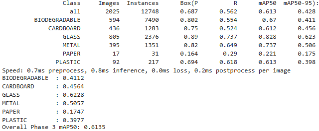
    
<strong>Fig. 11. </strong>Breakdown of precision, recall, and mAP scores across the seven garbage categories for phase 3.

The Confusion Matrix (Fig. 12) demonstrates a breakthrough in the Paper category. While Phase 2 saw a 73% background-miss rate, the Phase 3 model now successfully proposes regions for paper but frequently misclassifies them as Biodegradable (61%). This might be due to the dataset's imbalance, with 7,490 Biodegradable instances vs only 31 Paper instances in the validation set, the model has developed a probabilistic bias toward the majority class for light-colored, matte textures.

    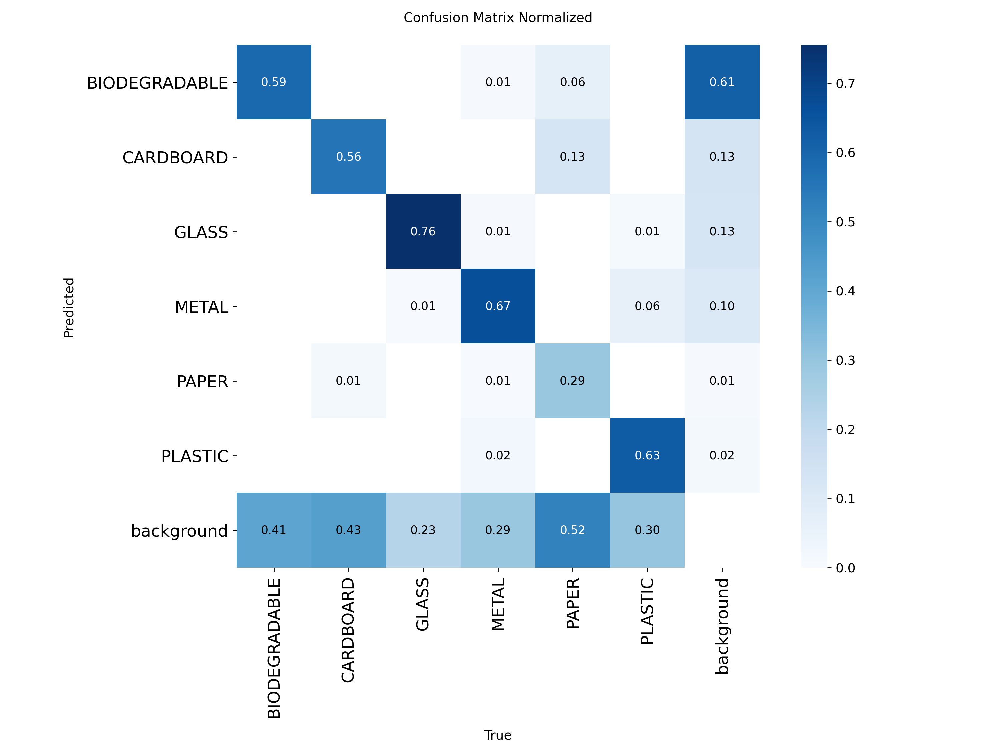
    
<strong>Fig. 12. </strong>High reliability is maintained in Glass (76%) and Metal (67%). However, the matrix reveals "Identity Confusion" for the Paper category. While background misses decreased, 61% of Paper instances are now misclassified as Biodegradable.

The F1-Confidence Curve (Fig. 13) confirms that the model's optimal operating point has shifted to 0.295. This indicates that the Phase 3 model is more certain of its detections, allowing for a higher confidence cutoff. This shift will result in fewer false positives during real-time tracking without sacrificing detection accuracy.

    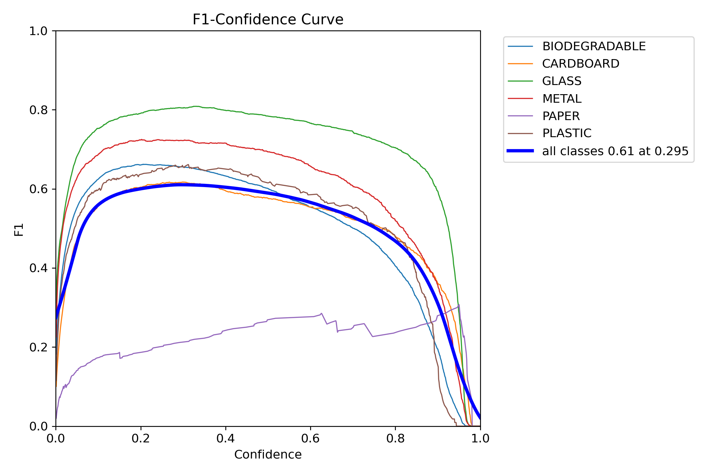
    
<strong>Fig. 13. </strong>The optimal operating threshold has shifted to 0.295 with a peak F1 score of 0.61.

Visual analysis of the Phase 3 validation batches (Fig. 14, Fig 15, Fig, 16) reveals a significant improvement in Spatial Logic. The model is now much better at isolating individual items in dense piles without the huge amounts of overlapping bounding boxes seen in previous iterations. However, a persistent label bias remains where items labeled as CARDBOARD in the ground truth are consistently relabeled as BIODEGRADABLE in predictions.

    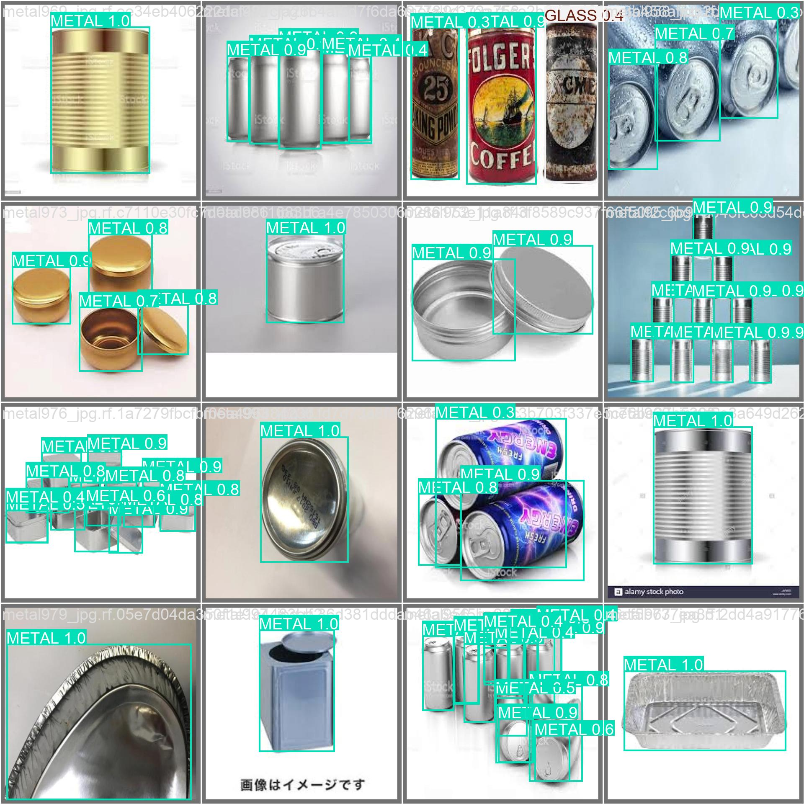
    
<strong>Fig. 14. </strong>The model demonstrates exceptional feature extraction for metallic textures and cylindrical shapes, achieving confidence scores between 0.8 and 1.0 across various lighting conditions and orientations.

    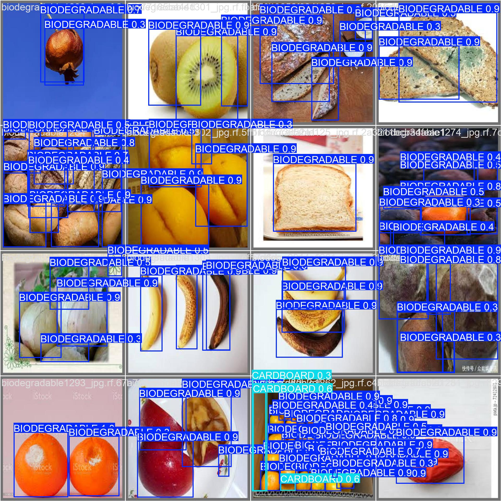
    
<strong>Fig. 15. </strong>While spatial isolation of organic items has improved, this batch highlights a persistent label bias where "Cardboard" ground-truth labels are incorrectly predicted as "Biodegradable" by the model.

    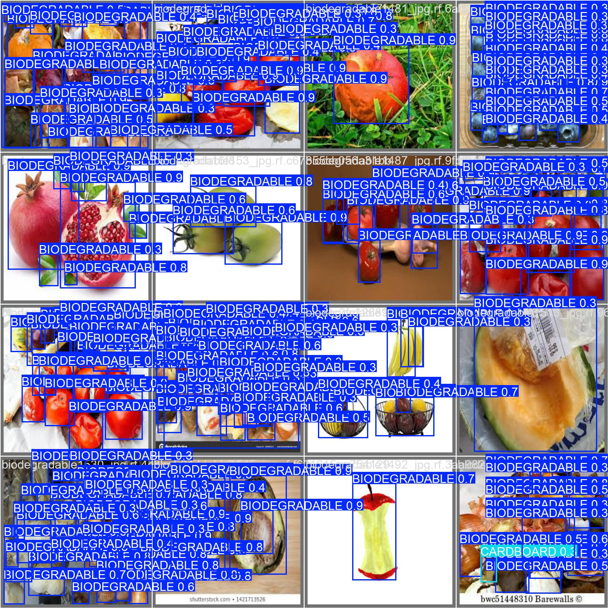
    
<strong>Fig. 16. </strong>The model successfully identifies individual components within dense organic piles. However, overlapping bounding boxes remain present in complex textures, suggesting a need for more aggressive NMS (Non-Maximum Suppression) tuning in the application layer.

Phase 3 successfully transitioned the model into a robust, high-performance system, achieving a 0.613 mAP50. The primary breakthrough was the resolution of the "Paper" category’s background-miss rate, suppressing redundant huge amounts of bounding boxes in organic clusters to prioritize individual object counts. Despite these improvements, a persistent "Identity Confusion" remains between light-colored processed materials and high-volume organic matter, driven by a significant probabilistic bias toward the Biodegradable class (7,490 vs. 31 instances). Phase 4 will pivot from raw data volume toward integrating null negative samples. 

### 3.4 Phase 4
Phase 4 pivots toward precision engineering by integrating 800 "Null" negative samples to calibrate the background and eliminate false positives on empty surfaces, while bumping the training resolution to 800px to amplify the critical textural differences between matte paper and organic grain. This transition is further reinforced by implementing texture-aware Adaptive Equalization preprocessing, which sharpens edge detection to resolve persistent white-on-white detection failures and stabilize the model for real-world deployment.

## References
